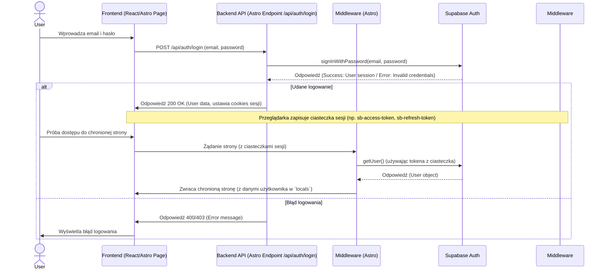

```mermaid
sequenceDiagram
    actor User
    participant Frontend (React/Astro Page)
    participant Backend API (Astro Endpoint /api/auth/login)
    participant Middleware (Astro)
    participant Supabase Auth

    User->>Frontend (React/Astro Page): Wprowadza email i hasło
    Frontend (React/Astro Page)->>Backend API (Astro Endpoint /api/auth/login): POST /api/auth/login (email, password)
    Backend API (Astro Endpoint /api/auth/login)->>Supabase Auth: signInWithPassword(email, password)
    Supabase Auth-->>Backend API (Astro Endpoint /api/auth/login): Odpowiedź (Success: User session / Error: Invalid credentials)
    alt Udane logowanie
        Backend API (Astro Endpoint /api/auth/login)->>Frontend (React/Astro Page): Odpowiedź 200 OK (User data, ustawia cookies sesji)
        Note over Frontend (React/Astro Page), Middleware: Przeglądarka zapisuje ciasteczka sesji (np. sb-access-token, sb-refresh-token)
        User->>Frontend (React/Astro Page): Próba dostępu do chronionej strony
        Frontend (React/Astro Page)->>Middleware (Astro): Żądanie strony (z ciasteczkami sesji)
        Middleware (Astro)->>Supabase Auth: getUser() (używając tokena z ciasteczka)
        Supabase Auth-->>Middleware (Astro): Odpowiedź (User object)
        Middleware (Astro)->>Frontend (React/Astro Page): Zwraca chronioną stronę (z danymi użytkownika w `locals`)
    else Błąd logowania
        Backend API (Astro Endpoint /api/auth/login)->>Frontend (React/Astro Page): Odpowiedź 400/403 (Error message)
        Frontend (React/Astro Page)->>User: Wyświetla błąd logowania
    end

``` 