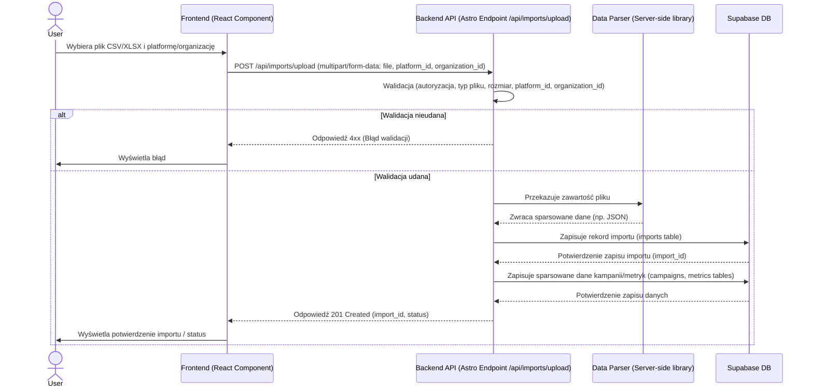

```mermaid
sequenceDiagram
    actor User
    participant Frontend (React Component)
    participant Backend API (Astro Endpoint /api/imports/upload)
    participant Data Parser (Server-side library)
    participant Supabase DB

    User->>Frontend (React Component): Wybiera plik CSV/XLSX i platformę/organizację
    Frontend (React Component)->>Backend API (Astro Endpoint /api/imports/upload): POST /api/imports/upload (multipart/form-data: file, platform_id, organization_id)
    Backend API (Astro Endpoint /api/imports/upload)->>Backend API (Astro Endpoint /api/imports/upload): Walidacja (autoryzacja, typ pliku, rozmiar, platform_id, organization_id)
    alt Walidacja nieudana
        Backend API (Astro Endpoint /api/imports/upload)-->>Frontend (React Component): Odpowiedź 4xx (Błąd walidacji)
        Frontend (React Component)->>User: Wyświetla błąd
    else Walidacja udana
        Backend API (Astro Endpoint /api/imports/upload)->>Data Parser (Server-side library): Przekazuje zawartość pliku
        Data Parser (Server-side library)-->>Backend API (Astro Endpoint /api/imports/upload): Zwraca sparsowane dane (np. JSON)
        Backend API (Astro Endpoint /api/imports/upload)->>Supabase DB: Zapisuje rekord importu (imports table)
        Supabase DB-->>Backend API (Astro Endpoint /api/imports/upload): Potwierdzenie zapisu importu (import_id)
        Backend API (Astro Endpoint /api/imports/upload)->>Supabase DB: Zapisuje sparsowane dane kampanii/metryk (campaigns, metrics tables)
        Supabase DB-->>Backend API (Astro Endpoint /api/imports/upload): Potwierdzenie zapisu danych
        Backend API (Astro Endpoint /api/imports/upload)-->>Frontend (React Component): Odpowiedź 201 Created (import_id, status)
        Frontend (React Component)->>User: Wyświetla potwierdzenie importu / status
    end
```
