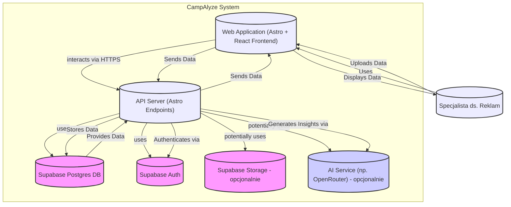

```mermaid
graph TD
    subgraph "CampAlyze System"
        direction LR
        WebApp[("Web Application (Astro + React Frontend)")]
        APIServer[("API Server (Astro Endpoints)")]
        Database[(Supabase Postgres DB)]
        AuthService[(Supabase Auth)]
        FileStorage[(Supabase Storage - opcjonalnie)]
        AIService[("AI Service (np. OpenRouter) - opcjonalnie")]

        WebApp -- interacts via HTTPS --> APIServer
        APIServer -- uses --> Database
        APIServer -- uses --> AuthService
        APIServer -- potentially uses --> FileStorage
        APIServer -- potentially uses --> AIService
    end

    User[("Specjalista ds. Reklam")] -- Uses --> WebApp

    User -- Uploads Data --> WebApp
    WebApp -- Sends Data --> APIServer
    APIServer -- Stores Data --> Database
    Database -- Provides Data --> APIServer
    APIServer -- Sends Data --> WebApp
    WebApp -- Displays Data --> User

    APIServer -- Authenticates via --> AuthService
    APIServer -- Generates Insights via --> AIService

    style WebApp fill:#lightblue,stroke:#333,stroke-width:2px
    style APIServer fill:#lightblue,stroke:#333,stroke-width:2px
    style User fill:#lightgrey,stroke:#333,stroke-width:2px
    style Database fill:#f9f,stroke:#333,stroke-width:2px
    style AuthService fill:#f9f,stroke:#333,stroke-width:2px
    style FileStorage fill:#f9f,stroke:#333,stroke-width:2px
    style AIService fill:#ccf,stroke:#333,stroke-width:2px
``` 